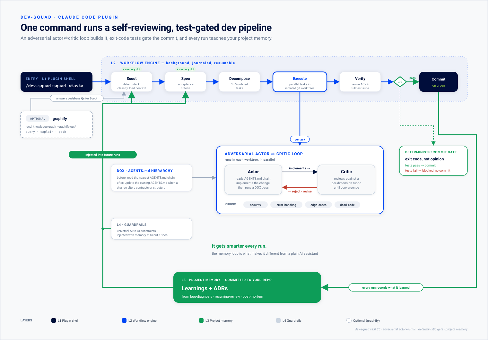
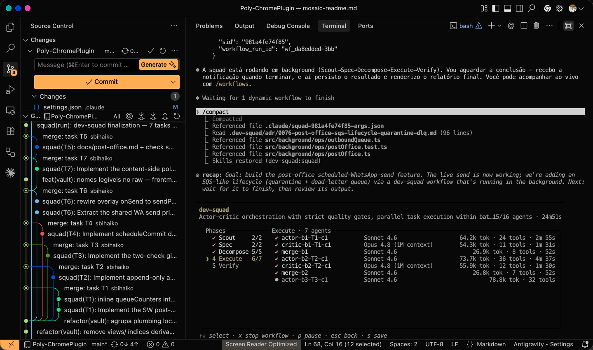

Anyone who programmed in the 90s probably came across a tool called Rational Rose. The promise was seductive: you drew the system in UML — a "box diagram" of elegant rectangles, connected by arrows full of intent — and the tool generated the skeleton of the code from that model.

For me, Rational Rose mattered. Not just for the promise of automation, but because it helped cement a paradigm shift: from relational thinking to object orientation. It also made Design Patterns more concrete, more visible, almost tangible. I used this kind of tool a lot, first to learn and then to teach the next generation of programmers.

In practice, someone would spend three weeks producing magnificent diagrams, print everything on letter-size sheets, glue them together until they formed a giant panel, and hang the thing on the meeting room wall. For a few days, it was beautiful. Then the diagrams began to die, the code moved on, the model fell behind.

We had invented documentation that aged faster than it could be read. Academics gave this disease a pretty name: **the divergence problem**. The model and reality drift apart, and the distance between them only grows.

In the next generation of CASE tools came TogetherJ, promising the famous *round-trip engineering*: if you changed the code, the diagram updated; if you changed the diagram, the code followed. It was paradise for diagrammers and paper salesmen. The idea was elegant. It got a little further, but it didn't solve the problem either. It went extinct.

Thirty years later, the ghost of Rational Rose is back. Only this time it doesn't speak UML, it speaks natural language. The code generator is no longer a deterministic *boilerplate* generator, it's an Artificial Intelligence that promises to swallow ambiguity, fill gaps, and guess what you meant — even when you don't quite know what you want yet.

The dream that failed in 2000 has been resurrected in new clothes. And the question it brings is the same as before: **does AI finally solve the divergence problem, or does it just get things wrong ten times faster?**

## The bottleneck has moved

In Part 1, I said that AI didn't eliminate work. It violently shifted the bottleneck. Like it or not, writing code stopped being the limiting factor. Coding became a commodity.

When one step in the process accelerates brutally, the pressure doesn't stay contained there — it overflows toward both ends: the input and the output. At the input, specification. At the output, validation.

It's almost a physics question. If you install an absurdly more powerful engine in the middle but keep the same input and the same output as before, you don't get a faster car. You get more chances of a breakdown or a crash.

The new power forces a re-engineering at the ends. Not a cosmetic swap of tooling, but a deep procedural change. **Specification** and **Validation** are symmetrical walls hit by the same shock wave.

And here lies the mathematical cruelty: if you produce software ten times faster, a definition error also propagates ten times faster. Specification, which was always important, became the place where the disaster is born.

It's at this point that it enters an existential contradiction: it needs to exist, but it can't weigh you down. It needs to guide, but it can't straitjacket. You want a map, but you don't want to carry a map the size of a continent on your back.

## The two tribes

Faced with this contradiction, software development seems to have split into two tribes. Nothing new. Programmers, like me, love spending hours debating abstractions and vehemently disagreeing with one another.

On one side is the **spec-driven** tribe: the complete, dense, rigorous specification crowd. It's the line of tools like GitHub's Spec Kit or Amazon's Kiro, and of the idea — defended with almost religious fervor in some 2025 talks — that "the spec is the new source code."

The reasoning is solid: if AI generates the code, then the valuable, durable, verifiable artifact stops being the code itself and becomes the specification. Write the perfect spec and the code becomes a disposable detail.

On the other side are the **vibecoders**. The term was coined by Andrej Karpathy in early 2025, in a definition that is at once honest and loaded with secondhand embarrassment: *"give in to the vibes, embrace exponentials, and forget that the code even exists."* You talk to the machine, describe what you feel you want, accept what it gives back, and move on. It's programming on the crest of the wave: no blueprint, no plan, on pure intuition.

The worst part is that, right now, I honestly can't say which of the two tribes is right. I'll even accept the hypothesis that both are wrong. To find out, all I could do was stretch each extreme to its limit and see what was left standing.

## Both sides are right — and that's why they're wrong

The problem is that, right now, each tribe is partially right. And that's the most dangerous way to be wrong.

Dense specification solves real problems. It gives the AI rich context, records intent shared between humans and machine, and produces something that can be validated.

But it charges three high prices:

The first is the obvious one: **time**. Writing a complete specification is slow — so slow that you run the risk of recreating, at the input of the process, exactly the bottleneck the AI just demolished in the middle. Congratulations: you automated coding only to reintroduce manual labor one step before it. The engine got ten times faster, but it was bolted to a hand-crank start.

The second is more serious: **inertia**. A dense specification is expensive to produce, and anything expensive we're reluctant to throw away. The sunk cost turns into an aversion to change. You cling to the plan precisely at the moment when the AI's speed should let you pivot without remorse. The dense spec, paradoxically, freezes you in a world where everything else has turned liquid. You built an anchor and called it a rudder.

The third is the sneakiest, and anyone who operates these models up close feels it in their bones: **the context window charges the bill — and it charges in two currencies**.

The first currency is literal: every line of specification pushed into the prompt is a token spent. And tokens, at scale, are real money leaving your pocket with every run.

The second currency is crueler, because it's paid in **quality**. Bloated context doesn't make the AI smarter; it makes it more lost. The more verbose the spec, the more the machine has to dig to find what matters — and the higher the chance it gets distracted by what doesn't. It confuses the accessory with the essential, loses the thread, and hallucinates with the ignorant confidence of a self-centered junior.

There's a point beyond which each extra paragraph of specification doesn't add precision. It subtracts it. You paid in tokens to buy more error.

Vibecoding, on the other hand, has the opposite "charm": zero inertia, instant exploration, cheap discovery. It's wonderful for going from nothing to something in minutes. But without shared intent, the AI drifts. It goes where the conversation pushes, not necessarily where the problem demands. Validation becomes hard — and I'll talk about that in Part 3. Spikes that should have been thrown away end up in production. And the pivot, which seemed like the great advantage, degenerates into *thrashing*.

It's dirt cheap to change direction every five minutes. The problem is that you never know whether you're going anywhere — and you risk never arriving anywhere at all. As Pirelli used to say: power is nothing without control.

## What we already knew in the 90s

Here the story gets delicious, because none of this is really new. The pendulum has already traveled this arc before. Anyone who lived through the 90s recognizes the landscape in all its details. And here we go again, charging at the ball like Charlie Brown — dead sure that this time Lucy won't yank it away, and landing flat on our back exactly like every time before.

The software industry started with heavy processes: the infamous *Big Design Up Front*, the complete blueprint before the first line of code, a direct inheritance from the waterfall model.

There was an almost psychological reason behind it. Back then, software development was desperate to be taken seriously as **engineering**. So it embraced the *hard* of civil engineering. And it imported, along with it, civil engineering's biggest limitation: you don't deconstruct a building with a click to rebuild it fifty feet to the left. If the concrete is irreversible, plan everything before you pour it. The complete blueprint wasn't aesthetic vanity; it was a defense against a material that doesn't accept change.

Software copied the rigidity of a world where every mistake is paid for in demolition — forgetting that its own material, the bit, could be undone and redone almost for free.

The irony is that, thirty years later, the wind changed direction. Today it's physical engineering that drinks from the software fountain. Additive manufacturing prints customized turbines with each release, prototypes are born and die within hours, and the atom has finally learned to be almost as malleable as the bit. We spent decades envying the solidity of concrete — and now it's concrete that envies our liquidity.

Software, meanwhile, internalized the borrowed rigidity so well that it struggles to recognize itself as what it always was: the most malleable construction material ever invented.

But let's get back to the 90s. After waterfall came RUP, the Rational Unified Process, fruit of the work of the Three Amigos — Booch, Jacobson, and Rumbaugh — and Barry Boehm's spiral model. They tried something wiser: an **iterative and incremental** process.

Instead of specifying everything at once, the project was divided into phases — inception, elaboration, construction, and transition — and understanding was refined with each turn. Elaboration existed precisely to discover the specification before committing to construction. It was a mature admission: you don't know everything on day zero.

But again we overdid it. Bureaucratic documentation became an addiction we were too blind to admit. Specification stopped being a tool and became an obstacle, straitjacketing projects and turning software development into something genuinely tedious and inefficient.

In 2001, the Agile Manifesto emerged as a furious reaction to the excess of documentation: "working software over comprehensive documentation." The pendulum swung to the other side: less blueprint, more delivery.

It was tempting to say that "the best specification is the code itself." It's a gorgeous sentence in the poetic sense, but a tiny fraction of teams manage to put it into practice. My experience says that number is smaller than 10%. The majority adopts cowboy coding as their official methodology. :)

And now? Now AI is pushing the pendulum back toward structure. Not because Agile was wrong, but for a new reason: AI **consumes context** as fuel. It works better when it receives explicit intent.

It's almost comical, in a bitter sense, to realize that the most futuristic sector on the planet is rediscovering, by fits and starts, a discussion that the gray-haired old-timers already had twenty-five years ago.

## The false dichotomy

This is exactly where the 90s hand us the key:

**vibecoding and dense specification are not opposite sides of a war. They are different phases of the same work.**

What we call **vibe** is the **elaboration** phase, the **exploration** phase. It's disposable by nature. Its function is to discover the specification.

The **dense spec** is the **construction** and **scaling** phase. It's durable. Its function is to enable validation, coordination, and growth.

The mistake of both tribes is the same: each takes a legitimate phase and turns it into a religion to govern the entire cycle. The vibecoder wants to improvise all the way to production. The spec-driven wants to plan all the way to paralysis. Both confuse a moment of the process with the whole process.

AI only made this mistake easier to commit, because it compressed the loop to the point where exploration and construction seem to happen at the same time. We lost the ability to see where one phase ends and the other begins.

## It's not *how much* spec. It's *which* spec.

If vibe and the dense spec are phases, not enemies, then the question "how much should I specify?" is badly framed. The right question is: **what, exactly, belongs in the specification?**

The answer I've been building over the past year is to decouple substance from volume. What makes a spec good isn't the amount of text, it's the amount of intent per paragraph — density isn't the problem; vacuity is. There's what's durable and there's what's disposable, and the tragedy of traditional dense specifications is mixing the two in the same document.

What's **durable** — and therefore belongs in the spec — is intent, contracts, invariants, constraints, and the why.

What's **disposable** — and therefore should be left out — is method signatures, screen pixels, folder structure, and premature implementation details.

The modern specification is not the frozen blueprint of the entire build. It's the distillation of what's expensive to recover once it's lost.

And here something curious started happening in practice. From the end of last year onward, the size of the specification I *need* to write got smaller and smaller. The tools got smarter, started filling gaps on their own, and — better still — **started asking me about the things I had forgotten to specify**.

The minimum spec, I realized, is the irreducible core of intent that the machine still can't guess. That core shrinks as the AI and its harness improve. But, at least for now, it never reaches zero. There's always a residue of intent that only you hold.

## Specifying is indispensable. Writing the spec by hand isn't.

General Eisenhower has a line that became a meeting-room cliché, but that here regains a surgical meaning: *"Plans are useless, but planning is indispensable."*

Translating it to our problem: the specification artifact is disposable; the **act of specifying** is non-negotiable.

The Argentine writer Jorge Luis Borges took this idea to the extreme in a one-page story, *On Exactitude in Science*. In it, the cartographers of an empire, obsessed with precision, draw a map at 1:1 scale — a map the exact size of the territory, coinciding point by point with reality. It was the perfect map and, for that very reason, completely useless. Because a map that doesn't simplify isn't a map. It's dead weight.

In the following generations, Borges tells us, the people abandoned the monstrous map to the harshness of the desert. The dense, frozen specification is that map of Borges: so faithful to the territory that it loses its usefulness as a map.

But there's a detail that Eisenhower's line hides. The fact that the act of specifying is indispensable **does not mean a human has to write the entire specification by hand**. What's non-negotiable is that the intent exists, explicitly, somewhere. Who types the text is an open question.

AI can — and should — handle a good part of the job: drafting, elaborating, detecting gaps, and, above all, **asking what was left out**. Specifying stops being solo authorship and becomes a co-authored dialogue.

The human provides the irreducible core of intent and judgment. The machine provides completeness, structure, and questions. The human's role migrates, subtly, from **author** to **ratifier**.

And here control, the theme of this entire series, doesn't disappear. It just changes place. Because filling a gap wrongly is the divergence problem coming back to life: the AI hallucinating your intent with its usual confidence.

The safeguard is the cycle: the AI drafts, the human ratifies the core, and deterministic mechanisms guard the rest.

## Korck and the bet on full autonomy

So far I've treated the tribes as abstractions. But I live them incarnated in two people: me and my friend Rafael Costa, a.k.a. Korck — one of the strongest advocates I know of fully autonomous coding and the author of the tool that will name the rest of this text: dev-squad.

For almost two years, Korck has held a bet: with **a single prompt**, the machine researches, understands, and delivers the final result. Full autonomy. I think this will one day be possible — I just don't know when it'll be one hundred percent true. That difference of faith between the two of us isn't a fight. It's the tension between the two tribes, lived in the flesh.

The opposite pole fell to me: engineering for the speed we **have**, not the one we **wish for**. While Korck built dev-squad aiming for full autonomy, I used it day to day and patched, by hand, the holes the tool didn't yet cover — writing specifications where the machine stumbled.

Each time I discovered a better way to specify, I passed the discovery on to Rafa, who decided whether it became a mechanism inside the tool. The ADRs — Architecture Decision Records, today native to dev-squad — were born from this back-and-forth: the RUP iterative-incremental cycle, running live between two friends and a tool.

## dev-squad, or the thesis turned into code

I promised, at the end of Part 1, to talk about living documentation and context-oriented architecture. Honest update: this thesis is no longer a garage bet. The big commercial harnesses are visibly converging on it — Codex already splits work across subagents and keeps memory between runs; Claude Code orchestrates fleets of subagents through deterministic workflows; GitHub Copilot's coding agent only moves forward if CI lets it. Different names, the same design: explicit phases, verification as a gate, learning that persists. When competitors who don't talk to each other arrive at the same architecture, that's not a coincidence.

I use dev-squad to unpack this design — not because it's the only one, but because it's the one I used to the bone, the thesis I know from the inside.

*Four layers: a command comes in, a six-phase pipeline runs, project memory writes ADRs and feeds them back into the next run, and universal AI-to-AI guardrails enforce constraints throughout.*

The pipeline runs from scout to commit in six phases. In the middle, an **Actor** implements and a **Critic** rejects it against a fixed rubric — security, error-handling, edge-cases, dead code — until it converges. And the commit only happens on the tests' exit code, never on a model's opinion.

The phase that matters most for this thesis is the **spec**: before any code, each specification passes through automatic, free checks. They block **emptiness** ("must work correctly" points to nothing concrete), watch the **target** (does what got resolved match what recent runs were touching?), and enforce **fidelity** (nothing you asked for can silently shrink along the way).

And each run feeds the next: learnings and ADRs written to the repository, reinjected into the next round. Not a spec frozen on the wall — a spec that regenerates.

*A real run: 15 of 16 agents finished in just under 25 minutes, Opus on the critique and Sonnet on the implementation, each task in its own git worktree — one task, one commit.*

Deep down, dev-squad refuses to choose between the two tribes. It separates two things the debate has always treated as one: *how you ask* and *how much rigor the request needs*. You keep talking to the machine in natural language, in vibe mode — but before it becomes code, what you asked for crosses an automatic gate, getting smarter with every run. Freedom stays at the start line; rigor stays at the gate.

It's Rafael's autonomy bet and my manual-specification pragmatism converging inside the same tool — neither of us gave up his side, but the tool learned to sustain both at once. And that's why watching the commercial harnesses arrive at the same place doesn't bother me — it reassures me. The thesis holds up not because one tool implemented it, but because several, starting from different points, were pushed toward it.

## The equilibrium point

In the end, maybe we were both walking toward the same place — only from opposite sides. Rafael bet on "one prompt"; I bet on the hand-written specification. It turns out that a sufficiently good prompt **is** a specification, and a sufficiently smart machine shrinks the spec down to that prompt and co-writes the rest. The two paths meet somewhere in the middle.

But that equilibrium point isn't "the spec disappears." It's the specification becoming a collaborative artifact: the human retreats to the irreducible intent, the machine advances until it covers everything derivable. Planning collapses to its essence — but doesn't vanish. And there was never a rule saying that essence had to be typed by human hands.

AI has already handed us the engine. Part 1 showed that power without control is just an efficient way to reach the disaster faster; this part tried to show where the first brake is: in the way we define the problem before the machine takes off to solve it.

Except that defining the problem well is worth absolutely nothing if you can't **prove** the machine solved it. That's where the other wall lives — the one at the output. In dev-squad, as in the harnesses walking the same path, the commit isn't released by the opinion of a model saying everything's fine; it's released by an exit code, by the real result of the tests. Exit code, not opinion.

## Now what?

In **Part 3**, the last of this series, I'm going to go head-to-head with the hardest problem of all: validation. How do you test a probabilistic, non-deterministic system that can respond differently to the same input? What does quality mean when software stops being a predictable machine and becomes a cognitive agent? And why is QA about to stop being a step in the process and become continuous control infrastructure?

Because specifying is indispensable — but verifying is what separates engineering from faith.

---

**The series — Power is Nothing Without Control:**

- [Part 1 — AI didn't eliminate work, it moved the bottleneck](/ConfidentlyWrong/blog/power-is-nothing-without-control-part-1/)
- **Part 2 — Specification: the ghost of generating software from a model (you're here)**
- Part 3 — Validation: testing a probabilistic system (coming soon)

---

**Links for the curious:**

- [Rational Rose and the dream of round-trip engineering (UML)](https://www.google.com/search?q=rational+rose+uml+round-trip+engineering+history)
- [Andrej Karpathy — the origin of the term "vibe coding" (2025)](https://x.com/karpathy/status/1886192184808149383)
- [GitHub Spec Kit — spec-driven development](https://github.com/github/spec-kit)
- [The Agile Manifesto (2001)](https://agilemanifesto.org/)
- [Jorge Luis Borges — "Del rigor en la ciencia" (the 1:1 scale map)](https://www.google.com/search?q=borges+del+rigor+en+la+ciencia+mapa+imperio)
- [dev-squad — Rafael's plugin, used as the example in the article](https://github.com/Korck-lab/dev_squad)
- [OpenAI Codex — the commercial harness converging on the same architecture](https://openai.com/index/codex-for-almost-everything/)
- [Charlie Brown and the football Lucy always pulls away (Peanuts)](https://www.youtube.com/watch?v=9ivn0C8oebg)
- [Cowboy coding — the methodology nobody admits to using](https://en.wikipedia.org/wiki/Cowboy_coding)
- ["We're going to choose cowboy coding every time" (Google for Developers)](https://www.youtube.com/watch?v=aYZL8raK-x8)
